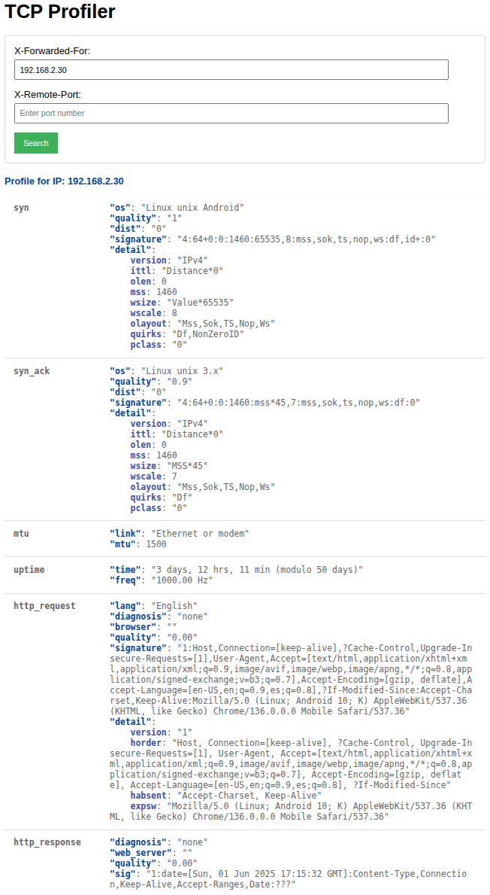

# TCP Profiler

## Introduction

This project was built to provide an easy-to-use, web-based interface for testing and profiling TCP, HTTP and TLS connections using the [huginn-net](https://github.com/biandratti/huginn-net) library. The motivation behind this project is to enable researchers, network engineers, and enthusiasts to analyze  connection characteristics in real time, without the need for complex command-line tools or manual packet analysis.

By exposing the huginn-net library through a simple web application, users can:
- Instantly view detailed TCP, HTTP and TLS connection profiles for their own or specified IP addresses.
- Experiment with different network scenarios and observe how signatures and metadata change.
- Use the tool for demonstrations, or diagnostics in real-world environments.

This project aims to make advanced profiling accessible and interactive, helping users better understand network behaviors and improve their own tools or research.

###  Get network Interface
```
ip link show
```

### Build and run
```
cargo build --release
```
```
sudo RUST_LOG=info ./target/release/huginn-net-profiler --interface <interface>
```
or debugging huginn-net
```
sudo RUST_LOG=huginn-net=debug ./target/release/huginn-net-profiler --interface <interface>
```


### Build and run docker image
```
docker build -t huginn-net-profiler .
```
```
docker run --network host huginn-net-profiler ./huginn-net-profiler --interface <interface>
```

### UI output

